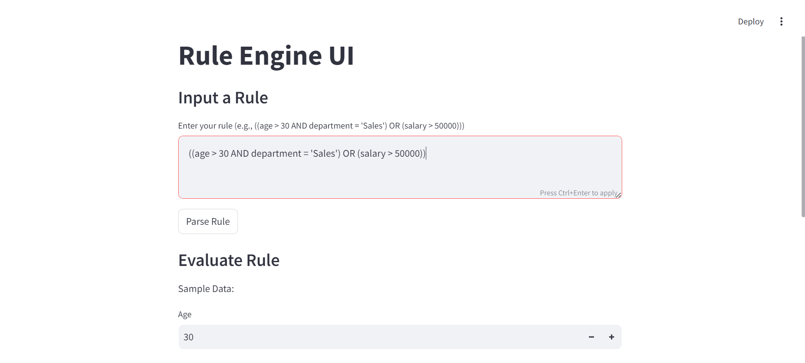
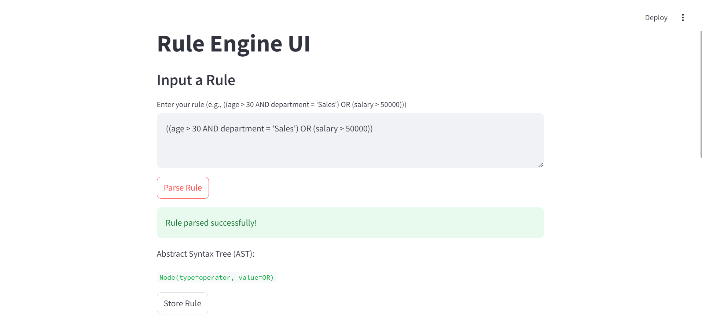
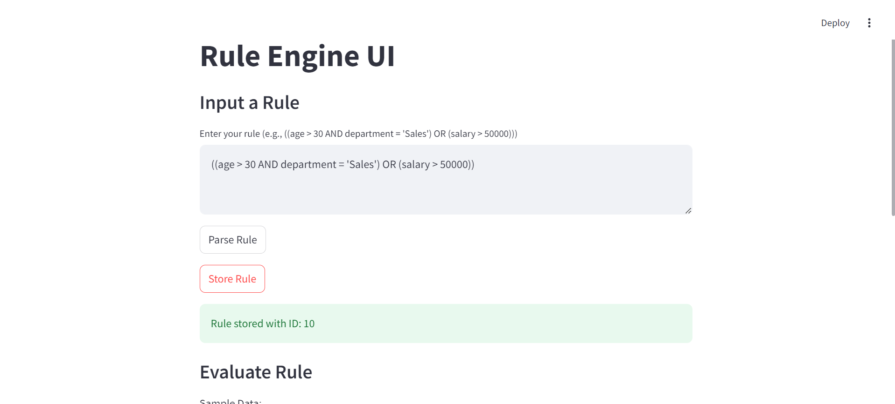
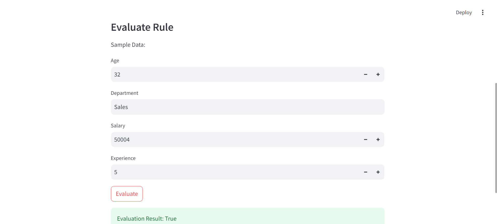

# Rule Engine with Abstract Syntax Tree (AST)


## Overview

This project implements a **Rule Engine** that utilizes an **Abstract Syntax Tree (AST)** to evaluate complex rules based on user-defined conditions. The engine allows users to define rules using logical operators and conditions, store these rules in a MySQL database, and evaluate them against specific attributes.

## Live Demo

You can check out the deployed version of the app here: [Rule Engine with AST - Live App](https://rule-engine-with-ast.streamlit.app/)

## Features

- **AST Representation**: Construct and visualize rules using an AST.
- **MySQL Integration**: Store and retrieve rules and AST nodes in a MySQL database.
- **Dynamic Rule Evaluation**: Evaluate rules against a set of attributes, supporting complex logical combinations.
- **Streamlit UI**: User-friendly web interface for inputting rules and evaluating them.

## Components

- **Database Connection** (`db.py`): Establishes a connection to the MySQL database.
- **Main Logic** (`main.py`): Handles rule creation, AST generation, storage, and evaluation logic.
- **User Interface** (`ui.py`): Streamlit application for user interaction.

## Prerequisites

- Python 3.x
- MySQL Server
- Required Python packages: 
  ```bash
  pip install mysql-connector-python streamlit

## Setup

### Step 1: Install Dependencies
Install the required packages using pip.

### Step 2: Set Up MySQL Database
Create a database named `rule_engine` in your MySQL server. Use the following SQL commands to create the necessary tables:
  
    ```sql
    CREATE TABLE rules (
        id INT AUTO_INCREMENT PRIMARY KEY,
        rule VARCHAR(255) NOT NULL
    );
    
    CREATE TABLE ast_nodes (
        id INT AUTO_INCREMENT PRIMARY KEY,
        rule_id INT NOT NULL,
        node_type ENUM('operator', 'operand'),
        value VARCHAR(255),
        left_child INT,
        right_child INT,
        FOREIGN KEY (rule_id) REFERENCES rules(id)
    );

### Step 3: Configure Database Connection
Edit the connect_mysql function in db.py to set your MySQL connection parameters (host, user, password).

### Step 4: Run the Streamlit Application
Run the Streamlit application to access the user interface:

    ```bash
    streamlit run ui.py
## Usage

1. Input a Rule: Enter your rule in the provided text area. The rule should follow the logical syntax, e.g., ((age > 30 AND department = 'Sales') OR (salary > 50000)).
   
   

3. Parse Rule: Click on "Parse Rule" to visualize the AST structure.
   
   

5. Store Rule: Once parsed successfully, you can store the rule and its corresponding AST in the database by clicking on "Store Rule".
   
   

7. Evaluate Rule: Enter sample data attributes to evaluate the stored rules.

   


## Error Handling

- Invalid rules will prompt an error message during parsing.
- Database connection issues or data format errors will be displayed as feedback in the UI.
  
## Contributing

Feel free to fork the repository and submit pull requests for any improvements or new features.

## License

This project is licensed under the MIT License.
